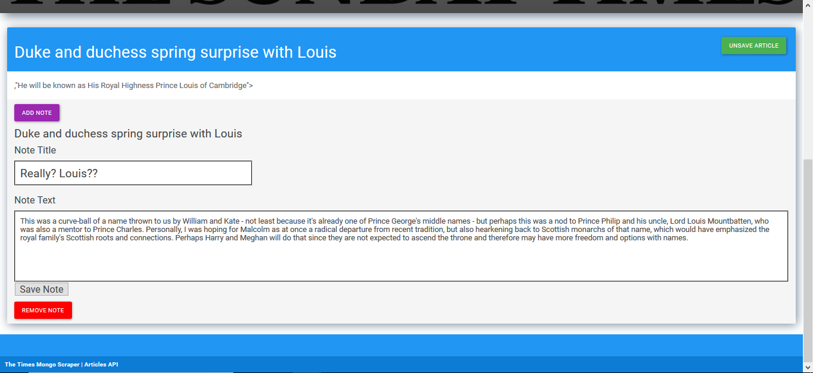

# Times-a-Scrapin

An app which srapes the *Times* and *Sunday Times* website for news articles, and allows the user to save/unsave articles and make/delete comments under said articles.

## How to Use

User opens application via the Heroku [link](https://times-a-scrapin.herokuapp.com/) to the homepage. If there are no articles available, then click on "SCRAPE NEW ARTICLES!" to retrieve the content, which should include the article title, link, summary, and buttons for saving the article and adding/removing comments. 

With the articles rendered to the page, click on any title to access its respective article on the *Times* website. In order to add a comment, click "Add/View Note", which opens a form for adding a title for the comment and the comment itself below. When finished with this, save the note by clicking "Save Note", but if the note needs to be changed after this, then click "Add/View Note" again, which results in the comment as written to appear and amendments can be to it before clicking "Save Note" to save the latest update. For simply viewing the notes, just click "Add/View Note" and then click "Save Note" to close the form.

For the purpose of removing a note, click "Remove Note", and the contents of the note will be removed. Click "Save Note" to close the form. 

If an article is to be saved for later reading and commenting, then click "Save Article". Any articles saved will then be transferred to the "Saved Articles" and may be accessed by clicking the button in the navigation bar of the same name. Saved articles will be rendered there, and not on the main page. Any notes made on an article before saving it will be transferred to the saved section with the article. When an article needs to be unsaved, click "Unsave Article" to send it back to the main page and remove it from the saved page. Any notes created or modified while the article was saved will be transferred to the main page and appear there as it was on the saved page. This also means that if a note was created while an article was unsaved, then modified or deleted while the article was saved, it will reflect the modification/deletion if it becomes unsaved again.

In short, the properties of the notes are transferrable regardless of the state of the article to which it is attached.

App also contains a link to the JSON data.

### Prerequisites

npm [express](https://www.npmjs.com/package/express)

npm [bodyParser](https://www.npmjs.com/package/body-parser)

npm [logger](https://www.npmjs.com/package/morgan)

npm [mongoose](https://www.npmjs.com/package/mongoose)

npm [axios](https://www.npmjs.com/package/axios)

npm [cheerio](https://www.npmjs.com/package/cheerio)

npm [request](https://www.npmjs.com/package/request)

npm [express-handlebars](https://www.npmjs.com/package/express-handlebars)

### Technologies Used

Languages - HTML5, CSS4, JavaScript

Libraries - Bootstrap, jQuery

Database - MongoDB

Run-time system - Node.js

Other tools, technologies, and techniques - API routing, AJAX, web-scraping

Text Editor - Visual Studio Code

## Preview

### Home (Main) Page
- - - -

### Scroll Down to Article
- - - -

### Click "Add/View Note" to see and write note
- - - -

### Article in Saved Articles
- - - -

### Note in Saved Articles
- - - -

### Modified note in Saved Articles
- - - -

### Article and modified note on Home (Main) Page with working link to article at lower right
- - - -

### Note deleted
- - - -

## Contributing

Please feel free to branch off with tweaks and making a repo; open to suggestions!

## Future Development

* Preventing more than one note/comment form from opening when "Add/View" or "Remove" buttons are clicked twice.
* Prevent the need to have to always "Save Note" when needing to close the comment/notes form.
* Better ensuring that scrapped articles are not duplicates of the ones already on the page.
* Making it so that the article moved from saved to unsaved and vice-sersa is shown immediately to disappear from the page when "Save"/"Unsave" is clicked.

## Authors

* **Wesley Hutchins** - [Github](https://github.com/WesPres1990)